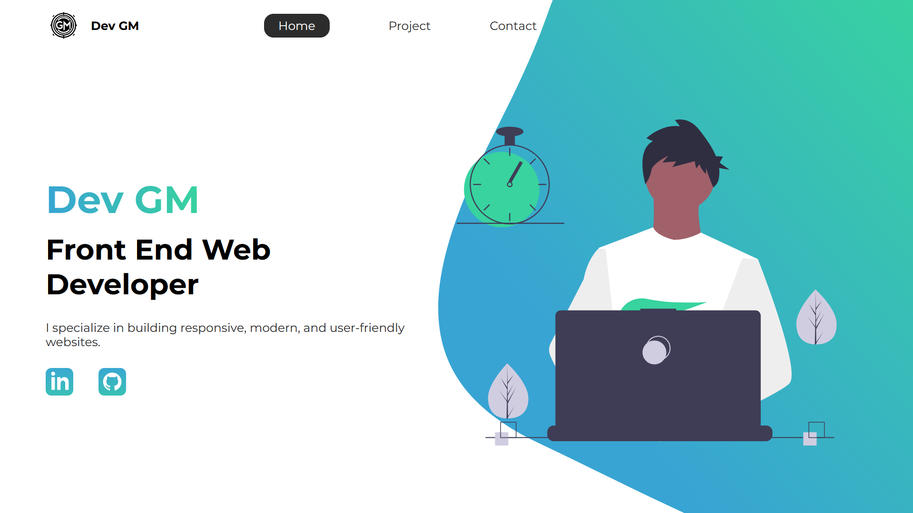

<h1 align="center">GM Portfolio</h1>

## 👋🏽 Introduction

Welcome to my portfolio! I’m a front-end web developer focused on creating modern, responsive designs and intuitive user experiences. In this portfolio, you’ll find an overview of my work, along with personal projects that showcase my skills and continuous learning in web development. I utilize tools like SASS, HTML, and JavaScript to craft efficient, modular, and visually appealing websites.

## 📚 Table of contents

- [👋🏽 Introduction](#-introduction)
- [📚 Table of contents](#-table-of-contents)
- [👨🏽‍💻 About me](#-about-me)
- [🛠 Technologies](#-technologies)
- [📺 How to view](#-how-to-view)
- [🖼 Previews](#-previews)
- [👨🏽‍🦱 Author](#-author)

## 👨🏽‍💻 About me

As mentioned earlier, I’m a recent graduate with a strong passion for web development, aiming to become a highly skilled developer capable of tackling challenging projects. While I’m still building my knowledge, I’m dedicated to continuous learning and improving my skills every day. My focus is on front-end development, but I am also exploring other areas to enhance my overall expertise in the field.

## 🛠 Technologies

  
  
    
  

## 📺 How to view

In case you want to take a look at the application, you can access the project at the official link just by [clicking here](https://guithr.github.io/my-portfolio/).

## 🖼 Previews

## 👨🏽‍🦱 Author

Developed by <b size="48px">Guilherme Matos</b> 
🚀

---

  
  

